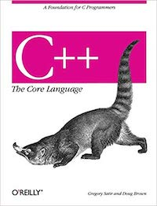

# Welcome Software Foundation Students!
## Assignment #1 --

You've successfully located the first assignment for ECE141a. For most of you, this assignment will be very straightforward. If you find yourself struggling, please reach out to the teaching staff. 

## Part 1 - Assigned Reading

Read chapter 1 and 2 in the textbook: C++ The Core Language. Don't worry -- this amounts to about 20 pages. 
For the sake of improving this course, please track how much time the reading takes you. 




## Part 2 - Setup your build environment

- If you're a windows user (sorry), download and install VisualStudio
- If you're a mac user, download and install Xcode
- If you're a unix user, install a modern C++ compiler, gdb, and your favorite code editor; makefiles may be provided
- There are other options (e.g. CLion) if the given options don't meet your needs

## Part 3 - Build, debug, checkin working code to github

There are four essential tasks to do related to our first assignment:

### 3.1 - Get the code to build

If you are using an IDE (like xcode or visualstudio), your first task is to create a project, and load the source files provided in this assignment. If you are command-line fan, you can use the provided makefile to build your code. 

It would be great if all the code you ever encounter compiled and work perfectly. It would also be great if Hulu and Netflix were free, but we don't always get what we want. In this case, you should expect that the code will not compile. 

This task is fix the problems you find in the source code. The code is a trivial command interpreter that parses and processes commands like a terminal shell. NOTE: The code doesn't actually run terminal commands, and you don't have to implement actual terminal commands. You do have to be able to identify the command to run (ignoring command case), and call the command (which will just print debug information).

The types of problems you'll encounter may include (but aren't limited to):
- Uninitialized variables
- Missing #include files
- Memory management issues
- Syntax errors 

Pay close attention to your compiler error messages, especially the first or second message you see. Sometimes errors/warning after the first few are unreliable, because the compiler has become very confused. 

Estimated newbie time: 1 hour. 

### 3.2 - Implement runTests()

Implement the `CommandProcessor::runTests()` method, and change `main()` to invoke this method. 

To correctly implement the `runTests()` method, you need to test each of your commands (there are 3). Commands may require 0, 1, or 2 arguments, and you'll need to write a test for each of the following scenarios:

#### CD commands

`cd ..` -- change current working directory to parent 

`cd path` -- change current working directory to given path

`cd` -- report an error due to the lack of an argument

#### LS commands

`ls` -- show files in current working directory

`ls *.txt` -- show files that meet the given filespec in the current working directory

#### MV commands

`mv file1 file2` -- move a file from one location to another

`mv arg1` -- report an error due to the lack of arg2

`mv` -- report an error due to the lack of arg1 and arg2

Your `runTests()` method should call 3 new methods you define:
```
  runCDTests();
  runLSTests();
  runMVTests(); 
```

As your tests run, they will emit output to standard out (via cout). Your output should look something like this:

```
runTests()
runCDTests(); 
...output from cd tests here...
runLSTests();
...output from LS tests here...
runMVTests();
...output from MV tests here...
```


Estimated newbie time: 2 hours. 

### 3.3 - Fill out the student.json file in your project directory

Inside the project directory you'll find a file called student.json. This file contains a few fields that identify you, and provide helpful information to "Vlad-the-Compiler" -- our auto-grading robot.

All you have to do to complete this step is fill out the personal information in student.json file. You need to provide a value for all of the fields you find in that file. Do NOT change the format of the file (it's JSON afterall), or Vlad-the-Compiler will be displeased.

Estimated newbie time: 5 minutes.

### 3.4 - Check in your final solution to github classroom

Finished? Woot! The last step is to check your code back into your git respository so it can be autograded. 

Estimated newbie time: 5-10 minutes.

## Part 4

Please review the provided source code and be prepared to answer questions you find in comments. It is strongly recommended that you consider each question, and use your textbook (or the Google machine) to work through the questions you encounter. We're trying to build reliable congnitive models here -- so take your time. 

Estimated newbie time: 1-2 hours. 
